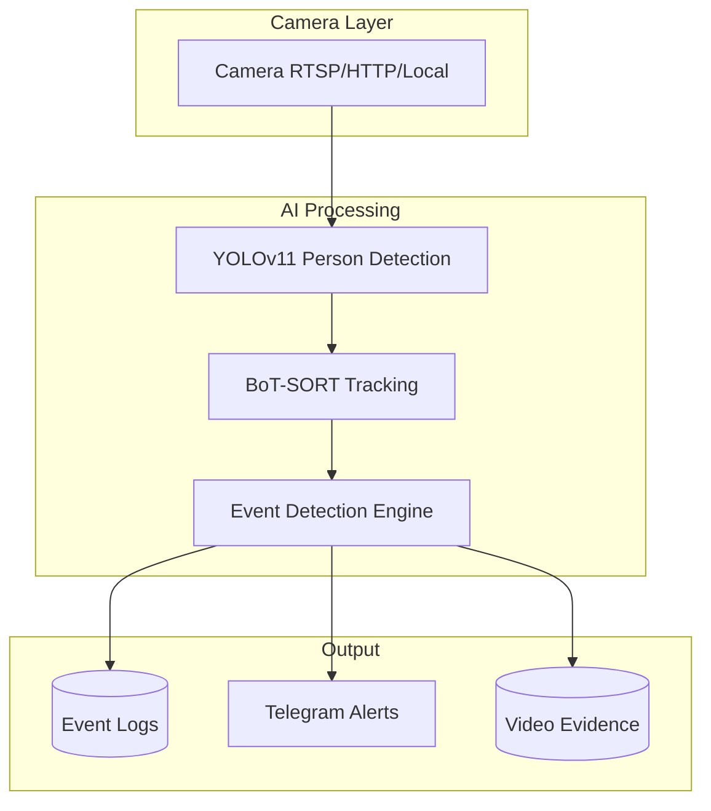

# SmartVision - Event-Based AI Surveillance System

SmartVision là một nền tảng giám sát thông minh **dựa trên sự kiện** (Event-Based), phát hiện các hành vi và tình huống bất thường trong thời gian thực. Hệ thống sử dụng **YOLOv11** cho person detection, **BoT-SORT** cho tracking, và các mô hình AI chuyên biệt cho từng loại sự kiện.

## ✨ Sự kiện phát hiện

-   🚨 **Xâm nhập** (Intrusion): Phát hiện người vào khu vực cấm
-   👊 **Đánh nhau / Bạo lực** (Violence): Nhận diện các hành vi hung hăng, đánh nhau
-   🤕 **Ngã / Tai nạn** (Fall Detection): Phát hiện người bị ngã hoặc nằm bất động
-   ⏱️ **Đứng lâu bất thường** (Loitering): Theo dõi người đứng/ngồi quá lâu tại một vị trí
-   🌙 **Người lạ ban đêm** (Night Stranger): Cảnh báo khi có người xuất hiện trong khung giờ nguy hiểm (22:00-05:00)

## 🔧 Công nghệ cốt lõi (Phase 1 - Completed)

-   **Person Detection**: YOLOv11n (Ultralytics 2024) - Nhanh hơn YOLOv8 22%, accuracy cao hơn
-   **Object Tracking**: BoT-SORT - Tracking ID consistency vượt trội, sử dụng Kalman filter cải tiến
-   **Multi-camera Support**: Kiến trúc đa luồng, xử lý song song không giới hạn camera
-   **Event Logging**: CSV structured logging với timestamp, event type, confidence, video evidence

## 🏗️ High-Level Architecture



## 🚀 Tech Stack

| Component | Technology | Version |
|-----------|-----------|---------|
| **Person Detection** | YOLOv11 (Ultralytics) | 8.1.0 |
| **Tracking** | BoT-SORT | Built-in |
| **Web Framework** | FastAPI | 0.104.1 |
| **Video Processing** | OpenCV | 4.8.1 |
| **Notifications** | Telegram Bot API | - |

**Upcoming (Phase 2-3):**
- Violence Detection: ViT-based classifier (Hugging Face)
- Fall Detection: MediaPipe Pose + LSTM
- Zone Management: Shapely (Polygon-based intrusion detection)

## 🛠️ Cài đặt & Khởi chạy

### 1. Yêu cầu hệ thống
-   Python 3.8+
-   Môi trường ảo (khuyên dùng): `python -m venv venv`
-   GPU (Tùy chọn, giúp tăng tốc độ xử lý)

### 2. Cài đặt thư viện
```bash
pip install -r requirements.txt
```

### 3. Cấu hình
Tạo file `.env` tại thư mục gốc và cấu hình các camera:
```env
TELEGRAM_BOT_TOKEN=your_token
TELEGRAM_CHAT_ID=your_id

# Cấu hình Camera 1
CAMERA_1_SOURCE=0
CAMERA_1_NAME=Main_Entrance

# Cấu hình Camera 2
CAMERA_2_SOURCE=http://192.168.1.100:8080/mjpeg
CAMERA_2_NAME=Parking_Lot
```

### 4. Khởi chạy
```bash
python -m src.realtime_server
```

Server sẽ khởi động tại `http://0.0.0.0:5001`

## 📡 API Endpoints

-   `GET /` - Dashboard status (FPS, số người phát hiện, camera info)
-   `GET /video_feed/{cam_id}` - Luồng video với AI overlays (bounding boxes, tracking IDs)
-   `GET /raw_feed/{cam_id}` - Luồng video gốc không có AI overlay

## 📁 Cấu trúc thư mục
-   `src/`: Mã nguồn chính của Server và module AI
-   `data/events/{cam_name}/`: Video bằng chứng cho các sự kiện
-   `logs/events_{cam_name}.csv`: Nhật ký sự kiện riêng cho từng camera

## 📊 Current Status (Phase 1)

✅ **Completed:**
- YOLOv11 person detection integration
- BoT-SORT multi-object tracking
- Multi-camera architecture
- Basic event logging infrastructure

🚧 **In Progress (Phase 2):**
- Intrusion detection (polygon zones)
- Loitering detection (time-based tracking)
- Night stranger detection (time-based rules)

📅 **Planned (Phase 3):**
- Violence detection (ViT classifier)
- Fall detection (MediaPipe + LSTM)

---

*Phát triển bởi SmartVision Team - Event-Based AI Surveillance.*
