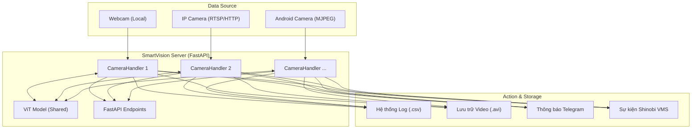
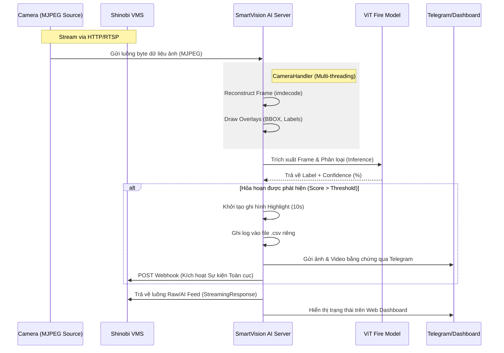

# SmartVision - Hệ thống Giám sát Hỏa hoạn AI Đa Camera

SmartVision là một nền tảng giám sát thông minh chuyên dụng cho việc phát hiện hỏa hoạn và khói thời gian thực. Hệ thống hỗ trợ kết nối không giới hạn số lượng camera, sử dụng mô hình **Vision Transformer (ViT)** hiện đại và tích hợp sâu với **Shinobi VMS** cùng **Telegram**.

## ✨ Tính năng nổi bật

-   🔥 **ViT Fire Detection**: Sử dụng mô hình `EdBianchi/vit-fire-detection` (Vision Transformer) cho độ nhạy bén và chính xác vượt trội so với các mô hình truyền thống.
-   📸 **Hỗ trợ Đa Camera**: Giám sát đồng thời nhiều ng# SmartVision - Hệ thống Giám sát Hỏa hoạn AI Đa Camera

SmartVision là một nền tảng giám sát thông minh chuyên dụng cho việc phát hiện hỏa hoạn và khói thời gian thực. Hệ thống hỗ trợ kết nối không giới hạn số lượng camera, sử dụng mô hình **Vision Transformer (ViT)** hiện đại và tích hợp sâu với **Shinobi VMS** cùng **Telegram**.

## ✨ Tính năng nổi bật

-   🔥 **ViT Fire Detection**: Sử dụng mô hình `EdBianchi/vit-fire-detection` (Vision Transformer) cho độ nhạy bén và chính xác vượt trội so với các mô hình truyền thống.
-   📸 **Hỗ trợ Đa Camera**: Giám sát đồng thời nhiều nguồn camera (Webcam, Camera IP, Camera Android...) thông qua kiến trúc xử lý song song.
-   ⚡ **Quản lý Độc lập**: Mỗi camera có luồng AI, file log, và folder lưu trữ video bằng chứng riêng biệt.
-   📲 **Cảnh báo Telegram Thông minh**: Gửi ảnh chụp bằng chứng kèm độ tin cậy (%) và video highlight 10 giây cho từng camera.
-   🎥 **Dual-Stream Storage**:
    -   `video_feed`: Luồng video có overlay AI (nhãn lửa, độ tin cậy %, v.v.).
    -   `raw_feed`: Luồng video sạch để hệ thống VMS ghi hình lưu trữ.
-   📊 **Dashboard Real-time**: Xem trạng thái FPS và báo động của tất cả các camera tại trang chủ.

## 🏗️ High-Level Design (HLD)

Kiến trúc hệ thống được thiết kế hướng đối tượng (Class-based) giúp quản lý đa luồng camera hiệu quả và dùng chung tài nguyên AI:



## ⚙️ Full System Pipeline (Luồng tuần tự)

Sơ đồ dưới đây mô tả chi tiết cách dữ liệu di chuyển từ Camera, qua Shinobi, tới AI Server và các kênh thông báo:



### Chi tiết các bước xử lý:

1.  **Ingestion & Standardizing**: `CameraHandler` kết nối tới Shinobi hoặc IP Cam, liên tục ghép các mảnh byte để tái tạo khung hình JPEG chuẩn.
2.  **Concurrency Control**: Mỗi Camera chạy một luồng xử lý ảnh riêng để đảm bảo tốc độ khung hình (FPS) mượt mà nhất.
3.  **Vision Transformer Pipeline**:
    *   Sử dụng **ViT (Vision Transformer)**: Không chỉ soi vật thể, mô hình này hiểu bối cảnh của toàn bộ ảnh để phân biệt lửa thật với ánh đèn màu cam.
    *   **Shared AI Resource**: Tất cả các camera dùng chung một bộ nhớ mô hình để tiết kiệm tài nguyên GPU/CPU.
4.  **Action Logic**: Khi mô hình đạt ngưỡng tin cậy, hệ thống tự động thực hiện 4 hành động song song: Ghi Log, Lưu Video, Gửi Telegram, và báo về Shinobi.
5.  **Output Delivery**: Server cung cấp luồng video độ trễ thấp thông qua `multipart/x-mixed-replace`, tương thích hoàn hảo với giao diện Shinobi Dashboard.
## 🚀 Tech Stack

Dự án sử dụng tập hợp các công nghệ tiên tiến nhất để đảm bảo hiệu suất và độ chuẩn xác:

-   **AI/Deep Learning**: [Vision Transformer (ViT)](https://huggingface.co/EdBianchi/vit-fire-detection), [Hugging Face Transformers](https://huggingface.co/docs/transformers/index), [PyTorch](https://pytorch.org/).
-   **Xử lý Hình ảnh**: [OpenCV](https://opencv.org/), [Pillow (PIL)](https://python-pillow.org/).
-   **Backend**: [Python 3.8+](https://www.python.org/), [FastAPI](https://fastapi.tiangolo.com/), [Uvicorn](https://www.uvicorn.org/).
-   **Tích hợp**: [Telegram Bot API](https://core.telegram.org/bots/api), [Shinobi VMS API](https://shinobi.video/docs/api).

## 🛠️ Cài đặt & Khởi chạy

### 1. Yêu cầu hệ thống
-   Python 3.8+
-   Môi trường ảo (khuyên dùng): `python -m venv venv`
-   NVIDIA GPU (Tùy chọn, giúp tăng tốc độ xử lý ViT)

### 2. Cài đặt thư viện
```bash
pip install -r requirements.txt
```

### 3. Cấu hình
Tạo file `.env` tại thư mục gốc và cấu hình các camera:
```env
TELEGRAM_BOT_TOKEN=your_token
TELEGRAM_CHAT_ID=your_id

# Cấu hình Camera 1
CAMERA_1_SOURCE=0
CAMERA_1_NAME=Cong_Chinh

# Cấu hình Camera 2
CAMERA_2_SOURCE=http://192.168.1.100:8080/mjpeg
CAMERA_2_NAME=San_Sau
```

### 4. Khởi chạy
```bash
python -m src.realtime_server
```

## 📁 Cấu trúc thư mục
-   `src/`: Mã nguồn chính của Server và module AI.
-   `data/highlights/{cam_name}/`: Nơi lưu trữ video bằng chứng theo từng camera.
-   `logs/fire_{cam_name}.csv`: Nhật ký hỏa hoạn riêng cho từng camera.

---
*Phát triển bởi SmartVision Team.*
uồn camera (Webcam, Camera IP, Camera Android...) thông qua kiến trúc xử lý song song.
-   ⚡ **Quản lý Độc lập**: Mỗi camera có luồng AI, file log, và folder lưu trữ video bằng chứng riêng biệt.
-   📲 **Cảnh báo Telegram Thông minh**: Gửi ảnh chụp bằng chứng kèm độ tin cậy (%) và video highlight 10 giây cho từng camera.
-   🎥 **Dual-Stream Storage**:
    -   `video_feed`: Luồng video có overlay AI (nhãn lửa, độ tin cậy %, v.v.).
    -   `raw_feed`: Luồng video sạch để hệ thống VMS ghi hình lưu trữ.
-   📊 **Dashboard Real-time**: Xem trạng thái FPS và báo động của tất cả các camera tại trang chủ.

## 🏗️ High-Level Design (HLD)

Kiến trúc hệ thống được thiết kế hướng đối tượng (Class-based) giúp quản lý đa luồng camera hiệu quả và dùng chung tài nguyên AI:


## ⚙️ Processing Pipeline

Quy trình xử lý dữ liệu từ đầu vào đến đầu ra:
1.  **Ingestion**: Thu thập luồng video đa nguồn thông qua OpenCV.
2.  **Pre-processing**: Chuyển đổi Frame sang định dạng RGB/PIL tương thích với mô hình Transformer.
3.  **Inference**: Sử dụng **ViT (Vision Transformer)** để phân loại hỏa hoạn với độ chính xác cao.
4.  **Decision**: Kiểm tra ngưỡng tin cậy (Threshold) và áp dụng cơ chế lọc nhiễu thực tế.
5.  **Alerting**: Kích hoạt cảnh báo tức thì qua Telegram (ảnh + video) và Shinobi Event.
6.  **Archiving**: Ghi lại 10 giây video bằng chứng và cập nhật nhật ký cho từng camera.
## 🚀 Tech Stack

Dự án sử dụng tập hợp các công nghệ tiên tiến nhất để đảm bảo hiệu suất và độ chuẩn xác:

-   **AI/Deep Learning**: [Vision Transformer (ViT)](https://huggingface.co/EdBianchi/vit-fire-detection), [Hugging Face Transformers](https://huggingface.co/docs/transformers/index), [PyTorch](https://pytorch.org/).
-   **Xử lý Hình ảnh**: [OpenCV](https://opencv.org/), [Pillow (PIL)](https://python-pillow.org/).
-   **Backend**: [Python 3.8+](https://www.python.org/), [FastAPI](https://fastapi.tiangolo.com/), [Uvicorn](https://www.uvicorn.org/).
-   **Tích hợp**: [Telegram Bot API](https://core.telegram.org/bots/api), [Shinobi VMS API](https://shinobi.video/docs/api).

## 🛠️ Cài đặt & Khởi chạy

### 1. Yêu cầu hệ thống
-   Python 3.8+
-   Môi trường ảo (khuyên dùng): `python -m venv venv`
-   NVIDIA GPU (Tùy chọn, giúp tăng tốc độ xử lý ViT)

### 2. Cài đặt thư viện
```bash
pip install -r requirements.txt
```

### 3. Cấu hình
Tạo file `.env` tại thư mục gốc và cấu hình các camera:
```env
TELEGRAM_BOT_TOKEN=your_token
TELEGRAM_CHAT_ID=your_id

# Cấu hình Camera 1
CAMERA_1_SOURCE=0
CAMERA_1_NAME=Cong_Chinh

# Cấu hình Camera 2
CAMERA_2_SOURCE=http://192.168.1.100:8080/mjpeg
CAMERA_2_NAME=San_Sau
```

### 4. Khởi chạy
```bash
python -m src.realtime_server
```

## 📁 Cấu trúc thư mục
-   `src/`: Mã nguồn chính của Server và module AI.
-   `data/highlights/{cam_name}/`: Nơi lưu trữ video bằng chứng theo từng camera.
-   `logs/fire_{cam_name}.csv`: Nhật ký hỏa hoạn riêng cho từng camera.

---
*Phát triển bởi SmartVision Team.*
